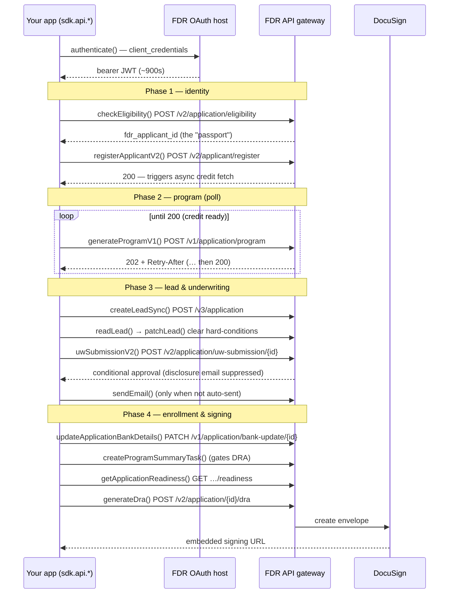

# @borrowbetter/arpcsdk

Typed, agnostic TypeScript client for FDR's **ARPC DEX** API — Achieve Resolution Partner Connect, Digital Enrollment Experience. It owns the two-host routing, the OAuth token lifecycle, and bearer injection, and exposes the full endpoint surface as typed operations generated from FDR's OpenAPI spec. Thin by design: you assemble payloads and drive the enrollment sequence; the SDK handles auth + transport + types.

## Installation

```bash
pnpm add @borrowbetter/arpcsdk
```

## Requirements

- Node.js >= 18
- FDR ARPC OAuth client credentials (provided by your FDR integration contact)

## Quick start

```typescript
import { ArpcSDK } from "@borrowbetter/arpcsdk";

const sdk = new ArpcSDK({
  oauthUrl: "https://oauth.stg.ffngcp.com",
  gatewayUrl: "https://apis-gateway-v2.stg.fdrgcp.com",
  username: "borrowbetter@seller.com",   // OAuth client_id (also the seller_agent_email)
  password: process.env.FDR_OAUTH_PASSWORD!,
});

await sdk.authenticate();                 // exchange credentials → bearer JWT (~900s TTL)

const elig = await sdk.api.checkEligibility({ /* … */ });
const faid = elig.data.application?.applicant?.fdr_applicant_id;

await sdk.api.registerApplicantV2({ /* … */ });
// … thread `faid` through the rest of the sequence (see below)
```

Every operation returns `{ status, data, headers }` and **never throws on a non-2xx** — a business gate (a UW/DRA readiness failure, a duplicate) comes back as a normal response you inspect via `status`/`data`. Only transport errors throw. `scripts/smoke.ts` is the full end-to-end reference sequence (including the program poll loop).

## How it works — the mental model

Four things to hold in your head:

- **Two hosts.** Auth happens on the **OAuth host** (`POST /v1/token`, HTTP Basic). Everything else goes to the **API gateway**. The SDK routes each call to the right one.
- **The passport.** `fdr_applicant_id` is minted once at eligibility and threads through *every* subsequent call. You carry it between operations.
- **Token lifecycle.** `authenticate()` exchanges credentials for a bearer JWT with a **~900s (15 min) TTL**, stored and attached to every `api` call. Re-call to refresh on a long run.
- **No-throw responses.** Operations return `{ status, data, headers }`. Branch on `status` — don't wrap every call in try/catch.

## The enrollment workflow

The SDK is agnostic — it doesn't impose an order. This is the sequence FDR's DEX flow expects, and what `scripts/smoke.ts` drives.



### Step by step

**Auth** — `sdk.authenticate()`. One call up front; refresh if the run runs long.

**Phase 1 — identity**
- `checkEligibility()` — stateless quote (no PII). Its critical job: it **mints `fdr_applicant_id`**. Registration doesn't return the id yet, so call eligibility first. *(FDR is working on making registerV2 return the id — not shipped yet.)*
- `registerApplicantV2()` — writes applicant PII and **kicks off an async credit pull**, which is why Phase 2 polls.

**Phase 2 — program (poll it yourself)**
- `generateProgramV1()` returns `202` + a `Retry-After` while the credit pull runs, then `200` with the program. **Loop until 200**, honoring `Retry-After` (usually ~12s, occasionally 20s+). See `scripts/smoke.ts` for the reference loop.

**Phase 3 — lead & underwriting**
- `createLeadSync()` — promotes to a real lead. Data authority shifts to FDR/Salesforce here.
- `readLead()` → `patchLead()` — the lead comes back with **hard-conditions** that block underwriting. Read their ids from `readLead()`, then `patchLead()` with each set `verified_by_debt_consultant: true`.
- `uwSubmissionV2()` — for these leads it comes back as **conditional approval almost every time**, which *suppresses* the automatic banking-disclosure email.
- `sendEmail()` — send the disclosure manually **only when UW didn't auto-send** (check `uw.data.banking_disclosure_email_sent`). Full approval auto-sends; conditional approval suppresses.

**Phase 4 — enrollment & signing**
- `updateApplicationBankDetails()` — attach bank details + banking-disclosure confirmation.
- `createProgramSummaryTask()` — records the program-summary review. **This gates DRA generation** — skip it and the `dra` readiness check fails. Returns `201`, not `200`, on success.
- `getApplicationReadiness()` — pre-flight; confirms the `uw_submission` and `dra` gates are verified.
- `generateDra()` — returns a **DocuSign embedded signing URL** (`dra.data.applicant?.url`). Single-use, ~5 min TTL. Successful signing triggers enrollment downstream.

### Endpoint reference

| `sdk.api.*` | Endpoint |
|-------------|----------|
| `checkEligibility` | `POST /v2/application/eligibility` (mints the applicant id) |
| `registerApplicantV2` | `POST /v2/applicant/register` |
| `generateProgramV1` | `POST /v1/application/program` (202 → … → 200 poll) |
| `createLeadSync` | `POST /v3/application` |
| `readLead` / `patchLead` | `GET` / `PATCH /v1/application/{id}` |
| `uwSubmissionV2` | `POST /v2/application/uw-submission/{id}` |
| `sendEmail` | `POST /v1/application/send-email/{id}` (only if UW didn't auto-send) |
| `updateApplicationBankDetails` | `PATCH /v1/application/bank-update/{id}` |
| `createProgramSummaryTask` | `POST /v2/application/program-summary-task/{id}` — **gates DRA** |
| `getApplicationReadiness` | `GET /v1/application/{id}/readiness` |
| `generateDra` | `POST /v2/application/{id}/dra` (DocuSign embedded signing URL) |
| `leadTransfer` | `POST /v1/application/lead-transfer` (retail handoff — see below) |

## Error handling & gotchas

- **Branch on `res.status`, not exceptions.** A gated call returns e.g. `{ status: 400, data: { error_code: "ER40301", … } }`.
- **`ER40301` at UW is often transient** — the readiness check hasn't caught up with the condition-verify you just did (live eventual consistency). Retry the UW submission after a short delay before treating it as terminal.
- **`ER40303` at DRA = missing draft/program dates** — a known FDR-side gap: the `dra` gate can reject on empty draft/program dates that no request field sets (they're backend-derived). Not a bug in your call.
- **Conditional vs full approval changes the email path** — always check `banking_disclosure_email_sent` before deciding whether to call `sendEmail()`.
- **Program timing varies** — the poll can take 20s+; don't set a tight timeout around the loop.

## Retail transfer (the drop-off path)

`sdk.api.leadTransfer()` hands a lead to FDR's **retail sales floor** — a human calls the applicant to help them enroll by phone. Two uses: **reactive** (the digital flow stalls or the applicant abandons → hand off to recover) or **proactive** (offer phone vs. online checkout up front).

Key property: **no inactivation.** Transferring does *not* close the digital lead — both stay active, and whichever path enrolls first wins. If retail enrolls first, a later digital enroll returns a duplicate / "already enrolled" error (expected). So calling it early is safe.

## Development

```bash
cp .env.example .env   # fill in STG credentials
pnpm install
pnpm codegen           # regenerate the typed client from the OpenAPI spec
pnpm smoke             # drive the full flow end-to-end against live STG
pnpm typecheck
pnpm build             # codegen + tsup → dist/ (esm + cjs + d.ts)
```

The typed client (`src/generated/`) is generated from the committed spec (`openapi/api-v2026.15.0.json`) and is not checked in — `pnpm codegen` (run automatically by `build`) reproduces it. To move to a newer spec, drop the JSON in `openapi/` and update `input.target` in `codegen.ts`.

## Releasing

Releases are automated via [Changesets](https://github.com/changesets/changesets) + GitHub Actions — no manual publish.

1. With your change, add a changeset describing it:
   ```bash
   pnpm changeset
   ```
   Pick the bump (patch/minor/major) and write a summary. Commit the generated `.changeset/*.md` alongside your code.
2. Merge to `main`. The **Release** workflow (`.github/workflows/release.yml`) then runs `changeset version` (bumps `package.json` + updates `CHANGELOG.md`, consuming the changeset), commits `chore: version packages`, and publishes to npm.

Publishing uses **npm OIDC trusted publishing** — no `NPM_TOKEN` secret. The trusted-publisher policy on npm is scoped to this repo + the `release.yml` workflow.
