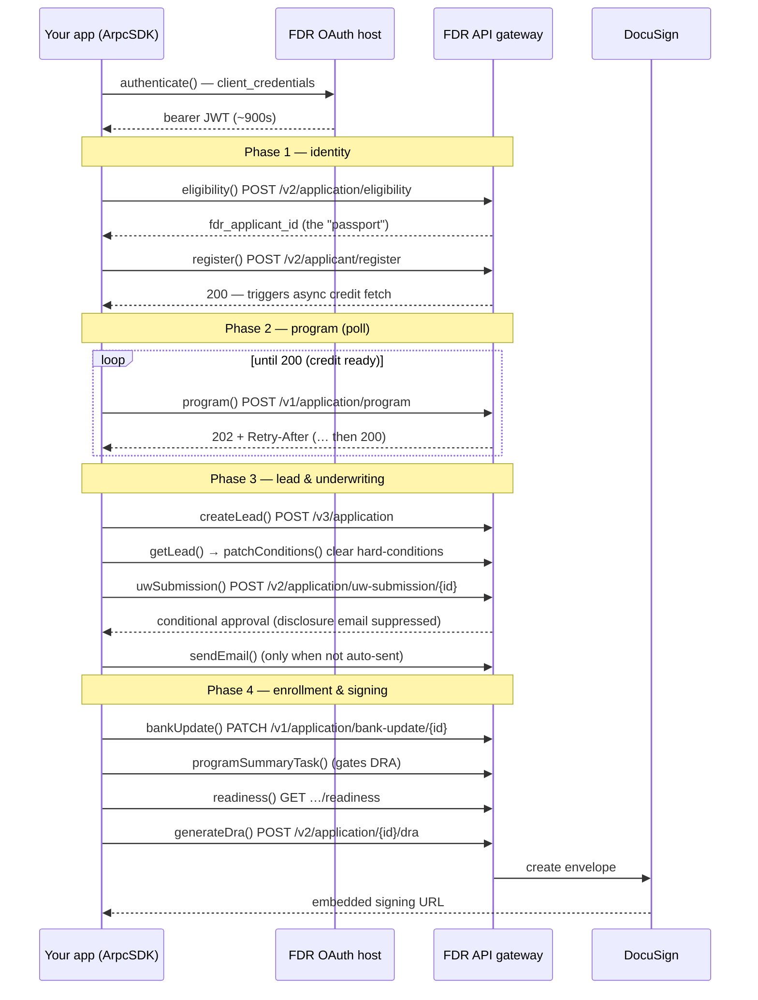

# @borrowbetter/arpcsdk

TypeScript SDK for FDR's **ARPC DEX** API — Achieve Resolution Partner Connect, Digital Enrollment Experience. Wraps the wholesale debt-resolution enrollment flow with a typed client (generated from FDR's OpenAPI spec) plus a hand-written orchestration layer for the multi-step sequence: token lifecycle, the async program poll, condition clearing, the program-summary DRA gate, and DocuSign signing.

## Installation

```bash
pnpm add @borrowbetter/arpcsdk
```

## Requirements

- Node.js >= 18
- FDR ARPC OAuth client credentials (provided by your FDR integration contact)

## Quick start

```typescript
import { ArpcSDK } from "@borrowbetter/arpcsdk";

const sdk = new ArpcSDK({
  oauthUrl: "https://oauth.stg.ffngcp.com",
  gatewayUrl: "https://apis-gateway-v2.stg.fdrgcp.com",
  username: "borrowbetter@seller.com",   // OAuth client_id (also the seller_agent_email)
  password: process.env.FDR_OAUTH_PASSWORD!,
});

await sdk.authenticate();          // exchange credentials → bearer JWT (~900s TTL)

const run = sdk.createRun();       // fresh enrollment run
await sdk.eligibility(run);        // mints run.faid
await sdk.register(run);           // anchors identity, triggers async credit fetch
await sdk.program(run);            // polls 202/Retry-After → 200
await sdk.createLead(run);
await sdk.getLead(run);            // read hard-condition ids
await sdk.patchConditions(run);    // clear them
await sdk.uwSubmission(run);
if (!run.disclosureAutoSent) await sdk.sendEmail(run);
await sdk.bankUpdate(run);
await sdk.programSummaryTask(run); // gates DRA generation
await sdk.readiness(run);
const dra = await sdk.generateDra(run);
console.log(dra.display.signing_url); // DocuSign embedded signing URL
```

Every step returns a `StepResult` — `{ ok, status, display, raw }`. Steps never throw on a gated non-2xx (e.g. a UW readiness gate); inspect `ok`/`status`/`raw` instead. Escape hatch: `sdk.api.*` exposes the raw typed operations, one method per gateway endpoint.

## How it works — the mental model

Five things to hold in your head before reading the flow:

- **Two hosts.** Auth happens on the **OAuth host** (`POST /v1/token`, HTTP Basic). Everything else goes to the **API gateway**. The SDK routes each call to the right one for you.
- **The passport.** `fdr_applicant_id` (aka `run.faid`) is minted once at eligibility and threads through *every* subsequent call. It's the single id that ties the applicant together across FDR's systems.
- **Token lifecycle.** `authenticate()` exchanges your credentials for a bearer JWT with a **~900s (15 min) TTL**. The SDK attaches it to every gateway call. For a long run, call `authenticate()` again to refresh.
- **The `Run` object.** `createRun()` returns a mutable bag of through-line state — the faid, the program result, the condition ids, the DRA envelope. Each step reads what it needs from the run and writes back what the next step needs. You just pass the same `run` down the chain.
- **Steps don't throw on a gate.** Every step returns a `StepResult` — `{ ok, status, display, raw }`. A business gate (a UW readiness failure, a duplicate, a missing prerequisite) comes back as `ok: false` with the real gateway body in `raw`, **not** an exception. Only transport/programming errors throw. So you branch on `result.ok`, not `try/catch`.

## The enrollment workflow



### Step by step

**Auth** — `authenticate()`. One call up front; refresh if the run runs long.

**Phase 1 — identity**
- `eligibility()` — a stateless quote (no PII). Its one critical job here: it **mints `run.faid`**. Registration doesn't return the id yet, so you must call eligibility first. *(FDR is working on making registerV2 return the id, which will make this optional — not shipped yet.)*
- `register()` — writes the applicant PII and **kicks off an async credit pull** in the background. This is why Phase 2 has to poll.

**Phase 2 — program**
- `program()` — the SDK **polls this in a loop**: while the credit pull is still running the gateway returns `202` + a `Retry-After`; once the report lands it returns `200` with the program (debt, payment options). Usually ~12s, occasionally 20s+. One call from your side — the loop is inside the step.

**Phase 3 — lead & underwriting**
- `createLead()` — promotes to a real lead. Data authority shifts to FDR/Salesforce here.
- `getLead()` → `patchConditions()` — the lead comes back with **hard-conditions** that block underwriting (name/address mismatch, unknown creditor on synthetic test data). `getLead()` reads their ids; `patchConditions()` marks them verified so UW can proceed.
- `uwSubmission()` — submits to underwriting. For our leads this comes back as **conditional approval almost every time**, which *suppresses* the automatic banking-disclosure email.
- `sendEmail()` — send the disclosure email manually **only when UW didn't auto-send it**. Guard on `run.disclosureAutoSent`: full approval auto-sends (skip this); conditional approval suppresses (call this). The banking disclosure is a legal prerequisite for enrollment.

**Phase 4 — enrollment & signing**
- `bankUpdate()` — attach the applicant's bank details + banking-disclosure confirmation.
- `programSummaryTask()` — records the program-summary review. **This gates DRA generation** — skip it and the DRA readiness check fails. (Returns `201`, not `200`, on success.)
- `readiness()` — final pre-flight; confirms both the `uw_submission` and `dra` gates are verified before signing.
- `generateDra()` — generates the Debt Resolution Agreement and returns a **DocuSign embedded signing URL** (`dra.display.signing_url`). The URL is single-use and expires in ~5 min. Successful signing triggers enrollment downstream.

### Endpoint reference

| Step | Endpoint |
|------|----------|
| `authenticate` | `POST {oauth}/v1/token` |
| `eligibility` | `POST /v2/application/eligibility` (mints the applicant id) |
| `register` | `POST /v2/applicant/register` |
| `program` | `POST /v1/application/program` (202 → … → 200 poll) |
| `createLead` | `POST /v3/application` |
| `getLead` / `patchConditions` | `GET` / `PATCH /v1/application/{id}` |
| `uwSubmission` | `POST /v2/application/uw-submission/{id}` |
| `sendEmail` | `POST /v1/application/send-email/{id}` (only if UW didn't auto-send) |
| `bankUpdate` | `PATCH /v1/application/bank-update/{id}` |
| `programSummaryTask` | `POST /v2/application/program-summary-task/{id}` — **gates DRA** |
| `readiness` | `GET /v1/application/{id}/readiness` |
| `generateDra` | `POST /v2/application/{id}/dra` (DocuSign embedded signing URL) |
| `leadTransfer` | `POST /v1/application/lead-transfer` (retail handoff — see below) |

## Error handling & gotchas

- **Branch on `result.ok`, not exceptions.** A gated step returns `ok: false` with the real error in `raw` (e.g. `{ error_code: "ER40301", … }`). Read `status`/`raw` to decide what to do.
- **`ER40301` at UW is often transient.** It means the readiness check hasn't caught up with the condition-verify you just did (live eventual consistency). Retry the UW submission after a short delay before treating it as terminal.
- **`ER40303` at DRA = missing draft/program dates.** A known open item: the `dra` gate can reject on empty draft/program dates that no request field sets (they're backend-derived). If you hit this, it's an FDR-side data issue, not your call being wrong.
- **Conditional vs full approval changes the email path** — see `sendEmail()` above. Always guard on `run.disclosureAutoSent`.
- **Program timing varies.** The poll can take 20s+; don't set a tight overall timeout around `program()`.

## Retail transfer (the fallback / drop-off path)

`leadTransfer()` hands a lead to FDR's **retail sales floor** — a human calls the applicant to help them enroll by phone. It's off the happy path, and you'd use it two ways:

- **Reactive** — the digital flow hits a roadblock or the applicant abandons → hand off so retail can recover the lead.
- **Proactive** — offer it up front so the applicant can choose **phone vs. online checkout**.

Key property: **no inactivation.** Transferring does *not* close the digital lead — both the digital and retail leads stay active, and whichever path enrolls first wins. If retail enrolls first, your later digital enroll returns a duplicate / "already enrolled" error (expected). Because of this, calling it early is safe.

## Development

```bash
cp .env.example .env   # fill in STG credentials
pnpm install
pnpm codegen           # regenerate the typed client from the OpenAPI spec
pnpm smoke             # drive the full flow against live STG (prints each step)
pnpm ui                # web smoke UI — dev endpoint view + a consumer checkout mock
pnpm typecheck
pnpm build             # codegen + tsup → dist/ (esm + cjs + d.ts)
```

The typed client (`src/generated/`) is generated from the committed spec (`openapi/api-v2026.15.0.json`) and is not checked in — `pnpm codegen` (run automatically by `build`) reproduces it. To move to a newer spec, drop the JSON in `openapi/` and update `input.target` in `codegen.ts`.

## Releasing

```bash
./publish.sh <npm-otp> [patch|minor|major]
```

Requires a clean tree on `main` and an npm login. Typechecks, builds, bumps the version, tags, pushes, and publishes `@borrowbetter/arpcsdk`.
