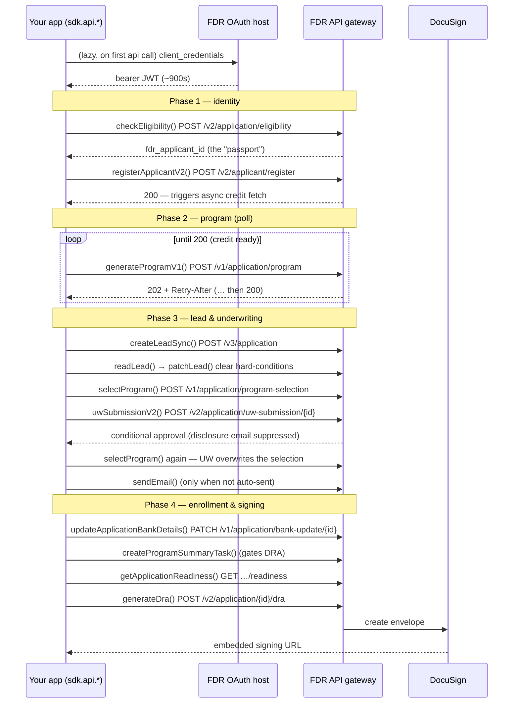

# @borrowbetter/arpcsdk

Typed, agnostic TypeScript client for FDR's **ARPC DEX** API — Achieve Resolution Partner Connect, Digital Enrollment Experience. It owns the two-host routing, the OAuth token lifecycle, and bearer injection, and exposes the full endpoint surface as typed operations generated from FDR's OpenAPI spec. Thin by design: you assemble payloads and drive the enrollment sequence; the SDK handles auth + transport + types.

## Installation

```bash
pnpm add @borrowbetter/arpcsdk
```

## Requirements

- Node.js >= 18
- FDR ARPC OAuth client credentials (provided by your FDR integration contact)

## Quick start

```typescript
import { ArpcSDK } from "@borrowbetter/arpcsdk";

const sdk = new ArpcSDK({
  environment: "stg",                      // "dev" | "stg" | "prd" — drives both hosts
  auth: {
    username: "borrowbetter@seller.com",   // OAuth client_id (also the seller_agent_email)
    password: process.env.ARPC_OAUTH_PASSWORD!,
  },
});

// The first api call authenticates automatically — it exchanges your
// credentials for a bearer JWT (~900s TTL), caches it, and reuses it.
const elig = await sdk.api.checkEligibility({ /* … */ });
const faid = elig.data.application?.applicant?.fdr_applicant_id;

await sdk.api.registerApplicantV2({ /* … */ });
// … thread `faid` through the rest of the sequence (see below)
```

Every operation returns `{ status, data, headers }` and **never throws on a non-2xx** — a business gate (a UW/DRA readiness failure, a duplicate) comes back as a normal response you inspect via `status`/`data`. Only transport errors throw. `scripts/smoke.ts` is the full end-to-end reference sequence (including the program poll loop).

## How it works — the mental model

Four things to hold in your head:

- **Two hosts, one switch.** Auth happens on the **OAuth host** (`POST /v1/token`, HTTP Basic). Everything else goes to the **API gateway**. You pick an `environment` and the SDK derives both — see [Environments](#environments).
- **The passport.** `fdr_applicant_id` is minted once at eligibility and threads through *every* subsequent call. You carry it between operations.
- **Automatic token lifecycle.** Every `api` call carries a bearer JWT (**~900s / 15 min TTL**) that the SDK manages for you: it exchanges your credentials on the first call, caches the token, attaches it to every request, and re-exchanges ~30s before expiry. Concurrent calls share a single exchange. See [Token caching](#token-caching) to persist or share the token.
- **No-throw responses.** Operations return `{ status, data, headers }`. Branch on `status` — don't wrap every call in try/catch.

## The enrollment workflow

The SDK is agnostic — it doesn't impose an order. This is the sequence FDR's DEX flow expects, and what `scripts/smoke.ts` drives.



### Step by step

**Auth** — handled for you. The SDK authenticates on the first `api` call, caches the token, and refreshes it automatically. See [Token caching](#token-caching) to control where the token lives.

**Phase 1 — identity**
- `checkEligibility()` — stateless quote (no PII). Its critical job: it **mints `fdr_applicant_id`**, which the rest of the flow threads through.
- `registerApplicantV2()` — writes applicant PII and **kicks off an async credit pull**, which is why Phase 2 polls. As of spec 2026.16.0 it also returns `fdr_applicant_id` (generated server-side when the request omits it), so registration-first is now viable if you don't need the quote.

**Phase 2 — program (poll it yourself)**
- `generateProgramV1()` returns `202` + a `Retry-After` while the credit pull runs, then `200` with the program. **Loop until 200**, honoring `Retry-After` (usually ~12s, occasionally 20s+). See `scripts/smoke.ts` for the reference loop.

**Phase 3 — lead & underwriting**
- `createLeadSync()` — promotes to a real lead. Data authority shifts to FDR/Salesforce here.
- `readLead()` → `patchLead()` — the lead comes back with **hard-conditions** that block underwriting. Read their ids from `readLead()`, then `patchLead()` with each set `verified_by_debt_consultant: true`.
- `selectProgram()` — commits the applicant to a payment schedule. Pick from the **lead's** `application.payment_schedule_options` (three tiers — Most Affordable / Best Value / Fastest — each with `regular`, `split` and `bi-weekly` schedules), then send the chosen `draft_type` + `estimated_monthly_payment`. See [Choosing a payment schedule](#choosing-a-payment-schedule).
- `uwSubmissionV2()` — for these leads it comes back as **conditional approval almost every time**, which *suppresses* the automatic banking-disclosure email.
- `selectProgram()` **again** — UW submission overwrites the selection with `Bi-Weekly`. Re-send the same schedule after UW, every time. See the gotcha below.
- `sendEmail()` — send the disclosure manually **only when UW didn't auto-send** (check `uw.data.banking_disclosure_email_sent`). Full approval auto-sends; conditional approval suppresses.

**Phase 4 — enrollment & signing**
- `updateApplicationBankDetails()` — attach bank details + banking-disclosure confirmation.
- `createProgramSummaryTask()` — records the program-summary review. **This gates DRA generation** — skip it and the `dra` readiness check fails. Returns `201`, not `200`, on success.
- `getApplicationReadiness()` — pre-flight; confirms the `uw_submission` and `dra` gates are verified.
- `generateDra()` — returns a **DocuSign embedded signing URL** (`dra.data.applicant?.url`). Single-use, ~5 min TTL. Successful signing triggers enrollment downstream.

### Endpoint reference

| `sdk.api.*` | Endpoint |
|-------------|----------|
| `checkEligibility` | `POST /v2/application/eligibility` (mints the applicant id) |
| `registerApplicantV2` | `POST /v2/applicant/register` |
| `generateProgramV1` | `POST /v1/application/program` (202 → … → 200 poll) |
| `createLeadSync` | `POST /v3/application` |
| `readLead` / `patchLead` | `GET` / `PATCH /v1/application/{id}` |
| `selectProgram` | `POST /v1/application/program-selection` (commit to a payment schedule) |
| `uwSubmissionV2` | `POST /v2/application/uw-submission/{id}` |
| `sendEmail` | `POST /v1/application/send-email/{id}` (only if UW didn't auto-send) |
| `updateApplicationBankDetails` | `PATCH /v1/application/bank-update/{id}` |
| `createProgramSummaryTask` | `POST /v2/application/program-summary-task/{id}` — **gates DRA** |
| `getApplicationReadiness` | `GET /v1/application/{id}/readiness` |
| `generateDra` | `POST /v2/application/{id}/dra` (DocuSign embedded signing URL) |
| `leadTransfer` | `POST /v1/application/lead-transfer` (retail handoff — see below) |

## Choosing a payment schedule

`payment_schedule_options[]` appears on the eligibility, program and lead applications. Each entry is a tier (`evaluation_type`: `Most Affordable` / `Best Value` / `Fastest`) carrying `program_length`, `program_cost`, and a `schedules[]` breakdown by draft frequency (`regular`, `split`, `bi-weekly`) with `draft_deposit` and `estimated_monthly_payment`.

```typescript
const lead = await sdk.api.readLead(faid);
const tier = lead.data.application?.payment_schedule_options
  ?.find((o) => o?.evaluation_type === "Best Value");
const schedule = tier?.schedules?.find((s) => s.draft_type === "bi-weekly");
if (!schedule) throw new Error("Best Value / bi-weekly not offered");

await sdk.api.selectProgram({
  applicant: { fdr_applicant_id: faid },
  draft_type: schedule.draft_type,                    // "bi-weekly"
  estimated_monthly_payment: schedule.estimated_monthly_payment,
});
```

Two things to know:

- **Select from the lead's options, not the quote's.** Eligibility and `generateProgramV1()` return pre-lead estimates. `createLeadSync()` submits the full income/expense picture and FDR **recalculates the program**, so the lead's tiers differ — in a smoke run, `Best Value` moved from `$380/mo` to `$560/mo`. Pick after the lead exists.
- **Request and response speak different vocabularies.** You send `draft_type: "bi-weekly" | "regular" | "split"`; the lead reports a capitalised label back on `application.draft_type` — `Bi-Weekly`, `Regular`, `Split`. (Through 2026.16.0 the spec documented `Monthly [Regular]` and `Twice Monthly [Split]` for the latter two, neither of which the API returns; 16.1 corrected the enum. The two vocabularies still differ, so the mapping stays.) The SDK exports the mapping so you don't hand-roll it:

  ```typescript
  import { DRAFT_TYPE_CODE, DRAFT_TYPE_LABEL, draftTypeOf } from "@borrowbetter/arpcsdk";

  DRAFT_TYPE_LABEL["bi-weekly"];       // "Bi-Weekly" — what the lead will report
  DRAFT_TYPE_CODE.Regular;             // "regular"   — what selectProgram accepts
  draftTypeOf(lead.data.application);  // "bi-weekly" | undefined
  ```

  `draftTypeOf()` closes the round-trip: read a lead, get a value you can hand straight back to `selectProgram`. It returns `undefined` for a lead with no selection *and* for a label we don't recognise (the server can ship a new picklist value before we've regenerated).

## Error handling & gotchas

- **Branch on `res.status`, not exceptions.** A gated call returns e.g. `{ status: 400, data: { error_code: "ER40301", … } }`.
- **UW submission rewrites the program selection to `Bi-Weekly`.** Not a clear — an overwrite, with the draft amount changed to match. Observed on both `regular` and `split`. Always call `selectProgram()` again after `uwSubmissionV2()`. It's invisible if you selected bi-weekly in the first place, which is why it's easy to miss. Note the UW response's own `application` is a thin projection (identity + status, no program fields — typed as `UwSubmissionV2Application` since 2026.16.1), so re-read the lead to check what actually happened.
- **`ER40301` at UW is often transient** — the readiness check hasn't caught up with the condition-verify you just did (live eventual consistency). Retry the UW submission after a short delay before treating it as terminal.
- **`ER40303` at DRA = the `dra` readiness gate rejected.** Read `error_details[]` for the specific field. The draft/program dates it checks are backend-derived — no request field sets them — so they're populated by `selectProgram()` and `createProgramSummaryTask()` upstream rather than by the DRA call itself. **`split` needs one extra call.** It fails the `secondDraftDateMissing` check ("Second draft date is required when draft type is split or bi-weekly") unless you `patchLead()` a `second_draft_date_split` **after UW submission and before generating the DRA** — added in 2026.16.1 in response to our report. Bi-weekly needs nothing: `second_draft_date_bi_weekly` is populated automatically at UW approval, and there is no patch field for it. `bi-weekly` and `regular` are what the smoke run exercises end-to-end; the `split` patch is documented but not yet driven by it.
- **Hardship and goal fields are UW-required despite being spec-optional.** `CreateLeadRequest` marks nothing required, and lead creation happily returns `200` without them — then UW fails with `ER40301` / `HARDSHIP_CHECK_FAILED`. Empirically the gate needs **all three** of `hardship_category`, `hardship_category_other` and `goal_category`; `goal_category_other` is genuinely optional. Note `hardship_category_other` is required even when the category isn't `Other`, contradicting its own description — reported to FDR. Also don't trust the `field` on that error: it has been observed naming a field that *was* supplied.
- **Readiness gates return the breakdown on `error_details`.** Since 2026.16.1 `ARPCErrorResponse.error_details` is a typed `ErrorDetails` (`checks[]`, `is_program_refresh_required`, `is_uw_approved`, `message`), so `ER40301` at UW and `ER40303`/`ER40305` at DRA are readable without a cast. Failures are documented as **`400`**; the `422` is now a separate generic `ER42200` for seller-config/upstream failures.
- **Read per-check failures off `error_details[]`, not `errors[]`.** Each `ReadinessCheck` now carries structured entries with a stable `reason_code` (`REQUIRED`, `DUPLICATE_EMAIL`, `CONDITION_NOT_VERIFIED`, `DEBT_TOTAL_MISMATCH`, …) and a dotted `field` path. `errors[]` is free text kept for compat — its wording changes.
- **Conditional vs full approval changes the email path** — always check `banking_disclosure_email_sent` before deciding whether to call `sendEmail()`.
- **Program timing varies** — the poll can take 20s+; don't set a tight timeout around the loop.

## Retail transfer (the drop-off path)

`sdk.api.leadTransfer()` hands a lead to FDR's **retail sales floor** — a human calls the applicant to help them enroll by phone. Two uses: **reactive** (the digital flow stalls or the applicant abandons → hand off to recover) or **proactive** (offer phone vs. online checkout up front).

Key property: **no inactivation.** Transferring does *not* close the digital lead — both stay active, and whichever path enrolls first wins. If retail enrolls first, a later digital enroll returns a duplicate / "already enrolled" error (expected). So calling it early is safe.

## Environments

`environment` is required and selects both hosts. Note they sit on different domains — the OAuth host is `ffngcp.com`, the gateway is `fdrgcp.com`.

| `environment` | OAuth host | API gateway |
| --- | --- | --- |
| `"dev"` | `https://oauth.dev.ffngcp.com` | `https://apis-gateway-v2.dev.fdrgcp.com` |
| `"stg"` | `https://oauth.stg.ffngcp.com` | `https://apis-gateway-v2.stg.fdrgcp.com` |
| `"prd"` | `https://oauth.prd.ffngcp.com` | `https://apis-gateway-v2.prd.fdrgcp.com` |

Credentials are issued per environment — a STG client_id will not authenticate against PRD.

Point at a host the table doesn't cover — a local mock, say — by overriding either one via `urls`. Anything you omit still comes from `environment`.

```typescript
const sdk = new ArpcSDK({
  environment: "prd",
  auth: { username, password },
  urls: { gateway: "http://localhost:8080" },  // oauth still from "prd"
});
```

The table is exported as `ARPC_ENDPOINTS` if you need to read a host without constructing an SDK. It's frozen — it backs both host resolution and environment validation, so mutating it isn't a supported way to redirect the SDK. Use `urls` for that.

## Token caching

By default the bearer token lives in-memory, per-process — good enough for a single long-running service. Pass `auth.cache` to change where it lives: persist it across restarts, or share one token across workers/instances instead of each exchanging its own.

```typescript
interface TokenCache {
  get(): Promise<string | null>;              // valid token, or null if absent/expired
  set(token: string, expiresAt: Date): Promise<void>;
}
```

The contract:

- **The cache owns expiry.** `get()` returns `null` once the token is stale; that `null` is what triggers a re-exchange. `expiresAt` is passed to `set()` already carrying the SDK's ~30s refresh skew, so honor it as-is.
- **The SDK single-flights the exchange** within a process, so a cold burst does one `/v1/token` call. Across processes, a brief overlap where two workers each exchange is possible and harmless — FDR issues independent tokens.

```typescript
// Example: share the token across a fleet via Redis.
const cache: TokenCache = {
  async get() {
    const [token, exp] = await redis.mget("arpc:token", "arpc:exp");
    return token && exp && Date.now() < Number(exp) ? token : null;
  },
  async set(token, expiresAt) {
    await redis
      .multi()
      .set("arpc:token", token)
      .set("arpc:exp", String(expiresAt.getTime()))
      .exec();
  },
};

const sdk = new ArpcSDK({
  environment: "stg",
  auth: { username, password, cache },
});
```

## Development

```bash
pnpm install
pnpm codegen           # regenerate the typed client from the OpenAPI spec
pnpm smoke             # drive the full flow end-to-end against live STG
pnpm smoke <user-id>   # ... as a specific test identity (see scripts/test-users.ts)
pnpm smoke --force-hard-conditions   # ... auto-verifying hard-conditions (test-only shortcut)
pnpm typecheck
pnpm build             # codegen + tsup → dist/ (esm + cjs + d.ts)
```

`pnpm smoke` reads its credentials from `.env` (via dotenv-flow):

```bash
ARPC_OAUTH_USERNAME=...
ARPC_OAUTH_PASSWORD=...
```

These are the smoke script's, not the SDK's — the library never reads `process.env`. The script pins `environment: "stg"` in code rather than taking it from `.env`: it drives a real enrollment against the canned STG test identity, so it must not be pointable at PRD.

The typed client (`src/generated/`) is generated from the committed spec (`openapi/api-v2026.16.1.json`) and is not checked in — `pnpm codegen` (run automatically by `build`) reproduces it. To move to a newer spec, drop the JSON in `openapi/` and update `input.target` in `codegen.ts`.

The spec's `Authentication` tag is excluded from codegen (`input.filters`): it documents `POST /v1/token`, which lives on the OAuth host with HTTP Basic and a form-encoded body, while every generated operation runs through the ky mutator and targets the gateway. `src/auth.ts` owns that exchange.

### Spec repairs

The vendored spec is byte-identical to what FDR published. Defects we've reported to them are patched at codegen time by `openapi/repairs.ts` (wired in as orval's `input.override.transformer`), so **the generated types intentionally differ from FDR's published docs** in these places:

| Repair | FDR ships | We generate |
|---|---|---|
| `select-program-error-responses` | `selectProgram` 401/500 → `ServerResponse`, an empty `{type: object}` | `ARPCErrorResponse`, matching every other operation; `ServerResponse` dropped |
| `program-selection-applicant-id` | `ProgramSelectionApplicant.fdr_applicant_id` optional, so `{ applicant: {} }` type-checks and 400s at runtime | the one field the endpoint reads, marked `required` |

2026.16.1 fixed three of the four repairs this file carried against 16.0 — the `draft_type` response enum, the `ProgramSelectionRequest.applicant` reference, and the readiness error envelope (`ARPCErrorResponse.error_details`). Their guards fired on the version bump and the repairs were deleted, which is the mechanism working as designed. Note `ReadinessErrorResponse` is no longer exported: readiness detail now hangs off `ARPCErrorResponse.error_details` as FDR's own `ErrorDetails`.

Each patched schema carries a `⚠️ Patched locally` note in its TSDoc, so the divergence is visible at the point of use.

**Repairs are designed to expire loudly.** Every one asserts the defect is still present before patching, and `pnpm codegen` fails with an actionable message if it isn't — so a fix on FDR's side breaks the build instead of leaving a dead patch behind. There's also a version gate: bumping the spec throws until each repair has been re-validated and `VERIFIED_AGAINST` is updated. That speed bump is deliberate; don't downgrade it to a warning.

## Releasing

Releases are automated via [Changesets](https://github.com/changesets/changesets) + GitHub Actions — no manual publish.

1. With your change, add a changeset describing it:
   ```bash
   pnpm changeset
   ```
   Pick the bump (patch/minor/major) and write a summary. Commit the generated `.changeset/*.md` alongside your code.
2. Merge to `main`. The **Release** workflow (`.github/workflows/release.yml`) runs `changeset version` (bumps `package.json` + updates `CHANGELOG.md`, consuming the changeset) on a `changeset-release/main` branch and opens a **chore: version packages** PR.
3. The same workflow run waits on that PR's checks and squash-merges it as soon as they're all green — no action needed from you. That merge lands on `main`, re-triggers Release with no changesets pending, and *that* run publishes to npm.

Nothing is pushed to `main` directly; the org rulesets don't allow it. Every repo-facing step runs as the `borrowbetter-automation` GitHub App, which is a `pull_request`-mode bypass actor on `org-require-pr-review` — that's what lets it merge a mechanical version bump without a human approval while still forcing the change through a PR. The merge gate is *every* check on the PR, not just the contexts the ruleset marks required, so a red typecheck stops the release even though CI isn't a required context.

If a release stalls, look for an open `chore: version packages` PR: a failed check leaves it sitting there and turns the Release run red. Fix forward on `main` and the next push rebuilds the branch from scratch.

Publishing uses **npm OIDC trusted publishing** — no `NPM_TOKEN` secret. The trusted-publisher policy on npm is scoped to this repo + the `release.yml` workflow, so don't rename or move that file. `workflow_dispatch` publishes whatever version `package.json` currently holds, for when a bump landed but the publish didn't.
